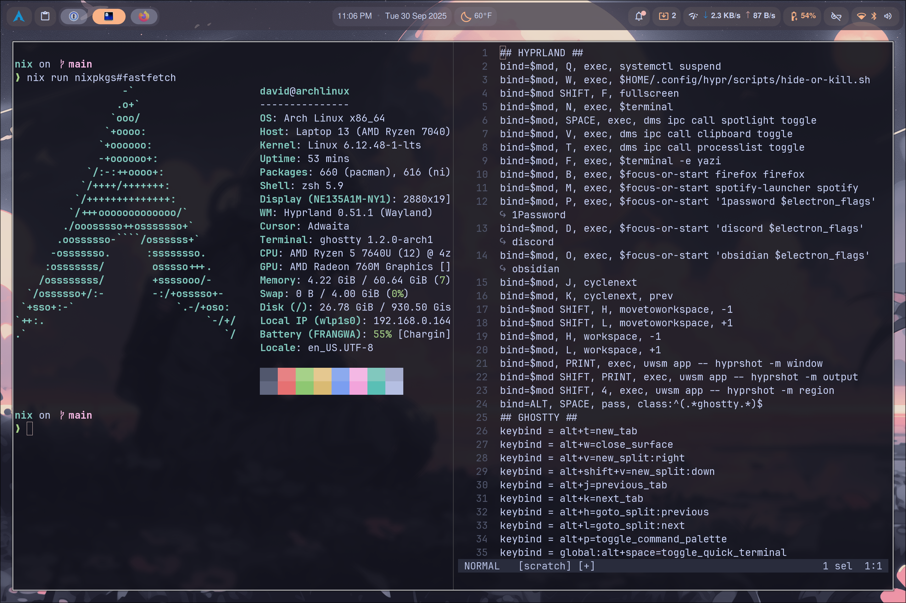

## Full Desktop Installation



```bash
nix run --experimental-features 'nix-command flakes' \
  nixpkgs#just -- bootstrap

just desktop
```


## Minimal Installation (home only)

```bash
nix run --experimental-features 'nix-command flakes' \
  nixpkgs#home-manager -- switch --flake .#home
```


## Bootstrapping a new Arch installation

### Boot from Arch iso

> [!WARNING]
> The 1password installation requires a system keyring to store MFA tokens. For convenience, the default keyring created with an empty password. This is okay as long as LUKS encryption is configured during `archintall`.

1. Use [iwctl](https://wiki.archlinux.org/title/Iwd) to connect to wifi.
2. Run `archinstall`...

  ```bash
  archinstall --config-url https://raw.githubusercontent.com/dbkegley/nix/refs/heads/main/archinstall/user_configuration.json
  #  Make sure to configure the following options:
  #  - default partitioning with btrfs
  #  - luks disk encryption + password
  #  - set root password
  #  - set log in user
  ```

3. (optional) After the installation completes, exit archinstall (do not chroot) and save `/var/log/archinstall` into `/mnt/root` if you want to.
4. Reboot.
5. Use `nmcli` to connect to wifi.
6. [Upgrade firmware](https://wiki.archlinux.org/title/Fwupd).

  ```bash
  # make sure the battery is less than 100% and the laptop is plugged in to power
  fwupdmgr refresh --force
  fwupdmgr get-updates
  fwupdmgr update
  ```

## Misc Notes

Check GPU driver status: `eglinfo -B`

Remove packages with `pacman -Rsnu`

Some of the package installations in `home.nix` use `package = null` because the nix version of the package is not compatible with arch. This allows home-manager to be used for configuration while installing system packages with `pacman -S`.

> This configuration was originally bootstrapped with:
  `nix flake init -t github:misterio77/nix-starter-config#standard`


### 1Password

`1password` was [really annoying to get working](https://www.1password.community/discussions/1password/1password-and-gnome-keyring-for-2fa-saving-on-archlinux/95688).

`just desktop` installs `1password`, `gnome-keyring` and `libsecret`. It also configures a default keyring with an empty password. `sddm` starts the keyring daemon and unlocks the keyring automatically on login. See the explanation [here](https://github.com/basecamp/omarchy/pull/1860#issue-3438642243) for details.
